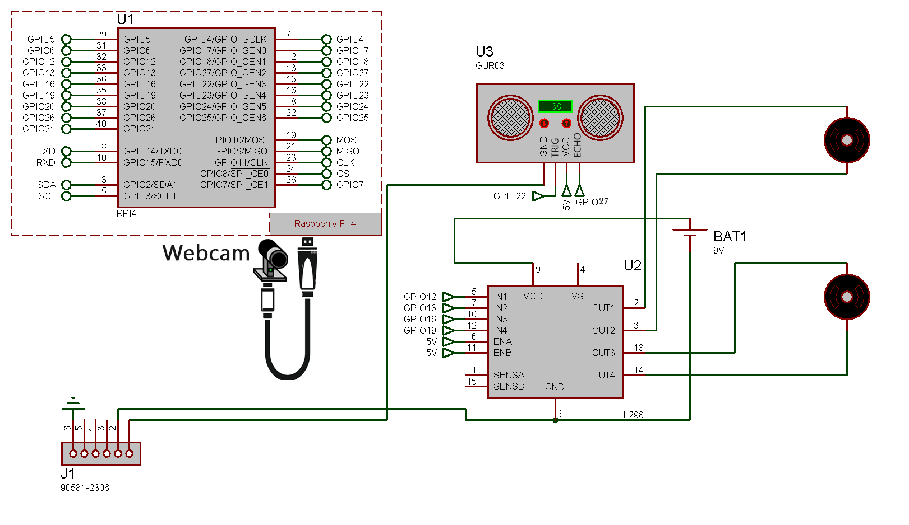
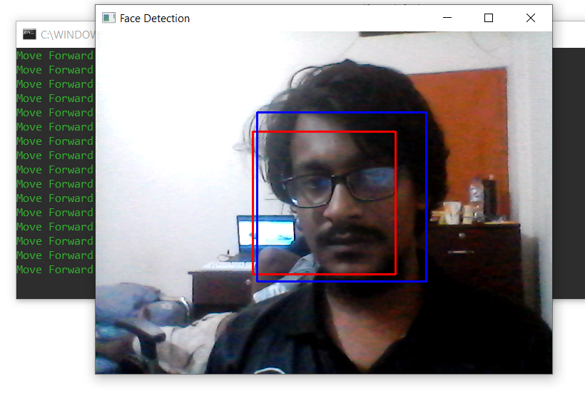
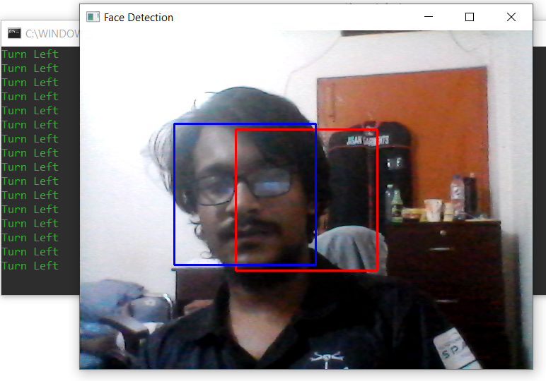
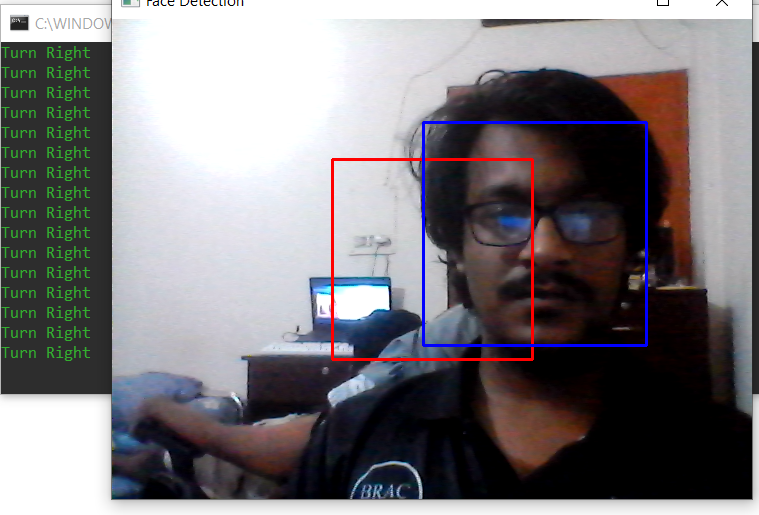

# Facebot Robot with Raspberry Pi

This project demonstrates how to build a robot using a Raspberry Pi that can detect faces using OpenCV and adjust its movement based on the detected faces and distance measurements from an ultrasonic sensor. It was build for BRACU CSE461 Project.

## Prerequisites

- Raspberry Pi with Raspbian OS
- Python 3.x
- OpenCV
- RPi.GPIO library

## Setup

1. Clone this repository to your Raspberry Pi.
2. Install the required libraries.
3. Connect the ultrasonic sensor and motor driver to the GPIO pins as defined in the code.

## Usage

1. Run the `main_robot.py` script.
2. The robot will use the camera to detect faces and adjust its movement to keep faces centered.
3. Press 'q' to exit the program.
## Circuit

## Screenshots of Results

## License

This project is licensed under the MIT License - see the [LICENSE](LICENSE) file for details.
